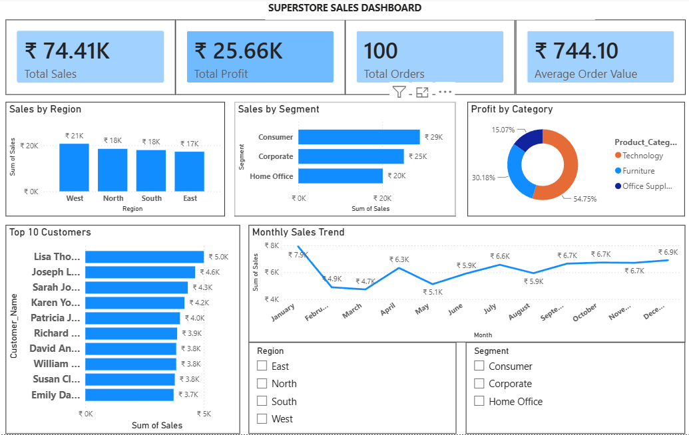

# Maincrafts Technology – Data Analytics & Business Intelligence Internship

## Task 2 – SQL, Excel & Power BI Dashboard

### Objective
Analyze Superstore sales data using SQL, Microsoft Excel, and Power BI to generate business insights.

## Dataset
- Orders.csv
- Customers.csv

## Tools Used
- MySQL
- Microsoft Excel
- Power BI Desktop

## SQL Analysis
- Customer-wise Sales
- Region-wise Sales
- Segment-wise Sales
- Product Category Profit
- Monthly Sales Trend
- Top Customers

## Excel Analysis
- Pivot Tables
- Pivot Charts
- Monthly Sales
- Region Analysis
- Segment Analysis

## Power BI Dashboard
KPIs:
- Total Sales
- Total Profit
- Total Orders
- Average Order Value

Visualizations:
- Sales by Region
- Sales by Segment
- Profit by Category
- Monthly Sales Trend
- Top 10 Customers
- Region Slicer
- Segment Slicer

## Dashboard

 

## Files Included
- Orders.csv
- Customers.csv
- SQL_Queries_Task2.sql
- Task2_Excel_Analysis.xlsx
- Task2_PowerBI_Dashboard.pbix
- Task2_PowerBI_Report.pdf

## Author
Akash R

Maincrafts Technology Internship
